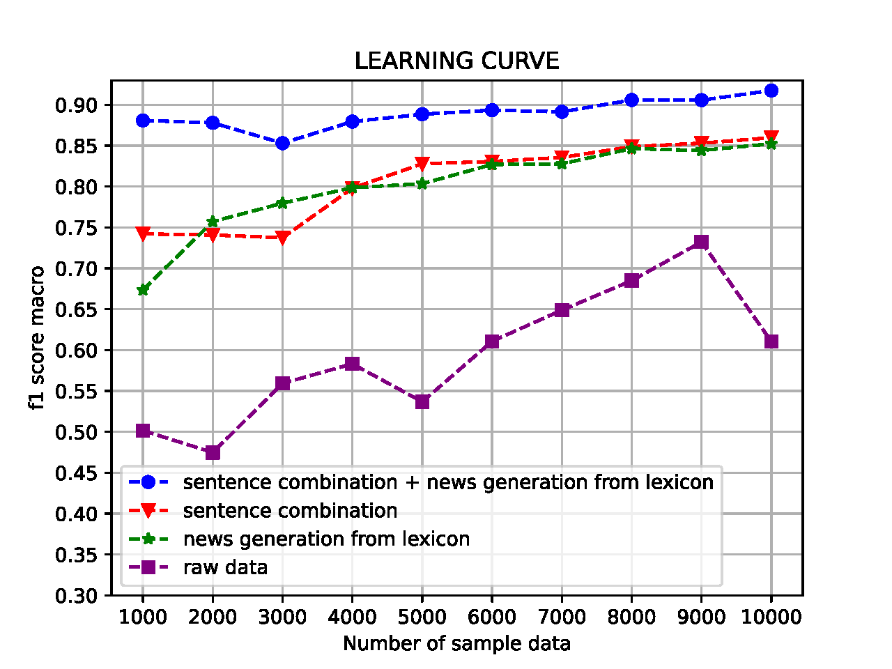

Look-through company's inetrnal value through public information
==============================

Project Organization
------------

    ├── LICENSE
    ├── .pylintrc                       <- Python style guidance
    ├── README.md                       <- The top-level README for developers using this project.
    ├── env                             <- CI configuration
    ├── data                            <- Our data sources
    │   ├── cnki_txt                            
    │   │    ├── data                           
    │   │    └── data_description.md            
    │   ├── company_metrics                     
    │   │    ├── data                           
    │   │    └── data_description.md            
    │   └── README.md                   <- Introduction to our data sources
    │
    │
    ├── models                          <- Trained and serialized models, model predictions, model summaries
    │   ├── DL_news_classifier          <- Popular deep learning methods for chinese news classification(BERT,ERNIE,TEXTCNN,RCNN...)         
    │   └── Self-built_news_classifier  <- The classifier I built for my dataset
    │
    ├── notebooks                       <- Jupyter notebooks I used for analysis
    │   └── Staged_results_202202.ipynb      
    │                         
    │
    ├── references                      <- Data dictionaries, manuals, and all other explanatory materials.
    │   └── REAMME.md      
    │
    ├── reports                         <- Generated analysis as HTML, PDF, LaTeX, etc.
    │   ├── reports                     <- Reports for staged results
    │   └── figures                     <- Graphics and figures to be used in reporting
    │
    ├── requirements.txt                <- The requirements file for reproducing the analysis environment, e.g.
    │                                   generated with `pip freeze > requirements.txt`
    │
    ├── setup.py                        <- makes project pip installable (pip install -e .) so src can be imported
    ├── src                             <- Source code for use in this project.
    │   ├── __init__.py                 <- Makes src a Python module
    │   │
    │   ├── data                        <- Scripts to download or generate data
    │   │   └── make_dataset.py
    │   │
    │   ├── features                    <- Scripts to turn raw data into features for modeling
    │   │   └── build_features.py
    │   │
    │   ├── models                      <- Scripts to train models and then use trained models to make
    │   │   ├── __init__.py                 
    │   │   ├── predict_model.py
    │   │   └── train_model.py
    │   │
    │   └── visualization               <- Scripts to create exploratory and results oriented visualizations
    │       └── visualize.py
    │
    └── tox.ini                         <- tox file with settings for running tox; see tox.testrun.org

--------

## WHY PUBLIC NEWS?

I believe news data can help us learn more about the real situation of the company. The company news released by authoritative media shields the noise caused by false information and subjective inference, and can most directly show the micro details of the company. Good news, bad news, even fake news can be useful for information gain. How to choose the cut-in angle which is the most efficient?

As can be seen from the above figure, most of points are in the area above the diagonal, it means the time point when the relevant indicators of negative news send out signals is earlier than the time point when the company officially announces the major changes. I guess maybe it is a good choice to cut in from the perspective of bad news.

## WHERE CAN WE GET OUR DATA SOURCES AND WHY WE CHOOSE IT?

1. **CNKI Full-text Database of Important Chinese Newspapers**

CNKI is the most authoritative academic data platform in China. The database contains **658** newspapers (**168 central level** + **490 province level**) from 31 provinces, covering all industries and nearly all the listed companies.

2. How I get our data sources

CNKI has a good defense against web crawlers, so I overcame a lot of technical difficulties to get this data source. This script provides a demo of our crawlers: **./crawler/demo.py**.

3. Raw data description

------------
    from province prospective
        coverage of province :                              31 / 31
        newspaper  amount in one province(min) :            4(Hainan)
        newsspapers amount in one province(max) :           30(Sichuan)
        newsspaper amount in one province(mean) :           15.8
    from article prospective
        article amount total :                              432812
        sentence amount total :                             35948282  
    from company prospective
        coverage of company :                               4101 / 4602
        article amount of one company(min) :                1
        article amount of one company(max) :                9342
        article amount of one company(mean) :               105.6
        article amount of one company(25% quantile) :       5
        article amount of one company(50% quantile) :       15
        article amount of one company(75 quantile) :        54
        article amount of one company(std) :                399.6
------------

4. Cleaned data description(data I use to do empirical study)

------------
                                                                                            bad news        not bad news        total
    Quantity :                                                                              20074           166386              186828
    Average length of news :                                                                71.50922        65.647488           66.26254
    Percentage of provincial and ministerial news :                                         53.601%         53.756%             53.748%
    Percentage of Central-level News :                                                      44.730%         45.529%             45.434%
    Number of listed companies involved :                                                   1704            3935                3942
    Number of news items containing words from the negative lexicon \ percentage :          19047\94.88%    13954\8.39%         33298\17.82%
    Number of news items that do not contain words in the negative lexicon \ percentage :   1027\5.12%      152432\91.61%       153530\82.18%
    Maximum news length :                                                                   223             223                 223
    Minimum news length :                                                                   6               6                   6
    Single stock involved in the maximum number of news \ stock code :                      826\300372.SZ   3659\000858.SZ      3987\000858.SZ
    Minimum number of news involving a single stock \ Stock code :                          1\000008.SZ     1\000005.SZ         1\000005.SZ
------------

5. All compamy metircs data I select

------------
    ---------------------------------------------------------------------
    Comapny metirc name                       | Category
    ---------------------------------------------------------------------
    CLOSE                                     | Quotes
    ---------------------------------------------------------------------
    Equity ratio                              | Solvency
    ---------------------------------------------------------------------
    EPS                                       | Profitability
    ---------------------------------------------------------------------
    Main business ratio                       | Profitability
    ---------------------------------------------------------------------
    Current ratio                             | Solvency
    ---------------------------------------------------------------------
    All Assets Cash Recovery Ratio            | Cash flow
    ---------------------------------------------------------------------
    Equity Multiplier                         | Solvency
    ---------------------------------------------------------------------
    ROA                                       | Profitability
    ---------------------------------------------------------------------
    ROE                                       | Profitability
    ---------------------------------------------------------------------
    Quick ratio                               | Solvency
    ---------------------------------------------------------------------
    Turnover                                  | Quotes
    ---------------------------------------------------------------------
    Updown                                    | Quotes
    ---------------------------------------------------------------------
    Cash ratio                                | Solvency
    ---------------------------------------------------------------------
    Cash turnover ratio                       | Operating capacity
    ---------------------------------------------------------------------
    Sales margin                              | Profitability
    ---------------------------------------------------------------------
    Gross profit margin                       | Profitability
    ---------------------------------------------------------------------
    Accounts Payable Turnover                 | Operating capacity
    ---------------------------------------------------------------------
    Accounts Receivable Turnover              | Operating capacity
    ---------------------------------------------------------------------
    Working capital/total assets              | Early warning indicators
    ---------------------------------------------------------------------
    Working capital turnover                  | Operating capacity
    ---------------------------------------------------------------------
    ZVALUE                                    | Early warning indicators
    ---------------------------------------------------------------------
------------

## HOW TO FIND BAD NEWS?

3. I try deep learning models and self-built models. Popular DL (deep learning) models did not have a good performance on our dataset, because Chinese words in the financial context have this uniqueness. I needed to build a lexicon and our own model to solve this problem. We can divide all of the steps into three different stages to build our own classifier (I cannot show model details before I finish this working paper, but can provide a demo in **./models/Self-built_news_classifier**.

### clean

### build bad news lexicon

### train

### model perfomance

#### model performance update(20220615)

## HOW BAD NEWS WORKS?

Inspired by the incredible work of Calomiris C W & Mamaysky H (2019), I guess I could classify bad news using unsupervised learning methods and infer topics by drawing word clouds.

### cluster result

It can be seen that although the number of negative news items is large, it still shows a trend of gathering in the top 9 categories. Before our paper is finished, I can't directly show what each type of negative topic is, but it can clearly be seen that although there are various types of negative news, their classification is actually very small.

Now that I have different types of bad news and different types of company metrics, I could do something cool. Maybe I could answer the question: "Bad news can bring information gain but how does it work?"

I believe that negative news is the information leakage of the deterioration of the microscopic situation of the enterprise. Different types of negative news represent the deterioration path of the enterprise in different ways. Based on our hypothesis, it should appear that the measurement indicators of different aspects of the enterprise have good feedback on the indicators based on the synthesis of negative news. However, their sensitivities will vary due to different pathways of action.

### Statistical test results

#### legend

#### result (E.g)

### Sensitivity of different indicators

I am testing if the results of the experiment are consistent with my conjecture. My working paper will be finished this year, so stay tuned!!!

------------
    Dream is a validation set.
    If we are underfitting, learn more to be a "complicated model".
    If we are overfitting, try more to "sample" or just learn to be "simple".
    Training is not to limit but to ascend, both for modeling and for our lifes. 
                                                                                  
                                                              ---qianyu 20220531
------------
